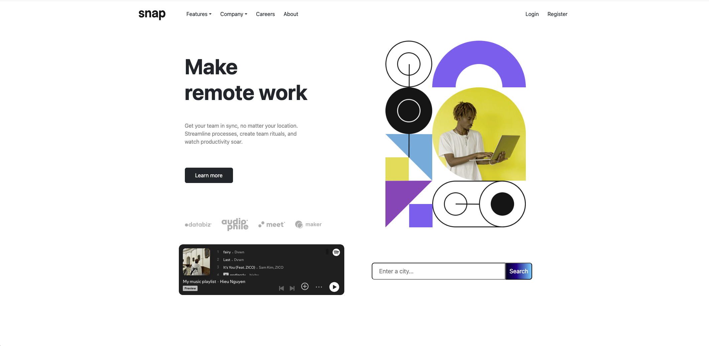

# React + Vite

This template provides a minimal setup to get React working in Vite with HMR and some ESLint rules.

Currently, two official plugins are available:

- [@vitejs/plugin-react](https://github.com/vitejs/vite-plugin-react/blob/main/packages/plugin-react) uses [Babel](https://babeljs.io/) for Fast Refresh
- [@vitejs/plugin-react-swc](https://github.com/vitejs/vite-plugin-react/blob/main/packages/plugin-react-swc) uses [SWC](https://swc.rs/) for Fast Refresh

## Expanding the ESLint configuration

If you are developing a production application, we recommend using TypeScript with type-aware lint rules enabled. Check out the [TS template](https://github.com/vitejs/vite/tree/main/packages/create-vite/template-react-ts) for information on how to integrate TypeScript and [`typescript-eslint`](https://typescript-eslint.io) in your project.

---

# Company Website Project   

A modern, responsive company website built with **React** and **Vite**, using design assets from [Frontend Mentor](https://www.frontendmentor.io/).
Focuses on clean structure, reusable components, and mobile-first design.

---

## 🔗 Demo

[Live Demo](https://hieunguyen601.github.io/company-website-project/)

---

## 📸 Screenshots


---

## ✨ Features

* Responsive design for mobile, tablet, and desktop
* Modular React components
* Styled using CSS and assets from Frontend Mentor
* Fast build & hot reload via Vite

---

## 🛠 Tech Stack

* **React 19** – UI library
* **Vite** – Development server & bundler
* **JavaScript (ES6+)**
* **CSS3**

---

## 🚀 Getting Started

### 1. Clone the repo

```bash
git clone https://github.com/hieunguyen601/Company-Website-Project.git
cd Company-Website-Project
```

### 2. Install dependencies

```bash
npm install
```

### 3. Run locally

```bash
npm run dev
```

Visit: `http://localhost:5173/`

---

## 📁 Project Structure

```
company-website-project/
├── public/            # Static assets
├── src/
│   ├── components/    # Reusable components
│   ├── assets/        # Frontend Mentor assets
│   ├── App.jsx        # Root component
│   └── main.jsx       # Entry point
├── package.json
├── vite.config.js
└── README.md
```

---

## 📤 Deployment (GitHub Pages)

### 1. Add `homepage` to `package.json`

```json
"homepage": "https://hieunguyen601.github.io/company-website-project"
```

### 2. Add deploy scripts

```json
"predeploy": "npm run build",
"deploy": "gh-pages -d dist"
```

### 3. Deploy

```bash
npm run deploy
```

---

## 🙌 Acknowledgements

* [Frontend Mentor](https://www.frontendmentor.io/) for design inspiration
* [React](https://react.dev/) & [Vite](https://vitejs.dev/) for development tools

---

## 📄 License

This project is licensed under the [MIT License](LICENSE).

